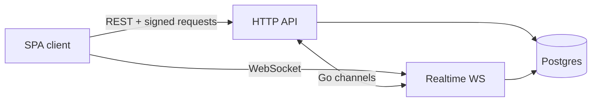
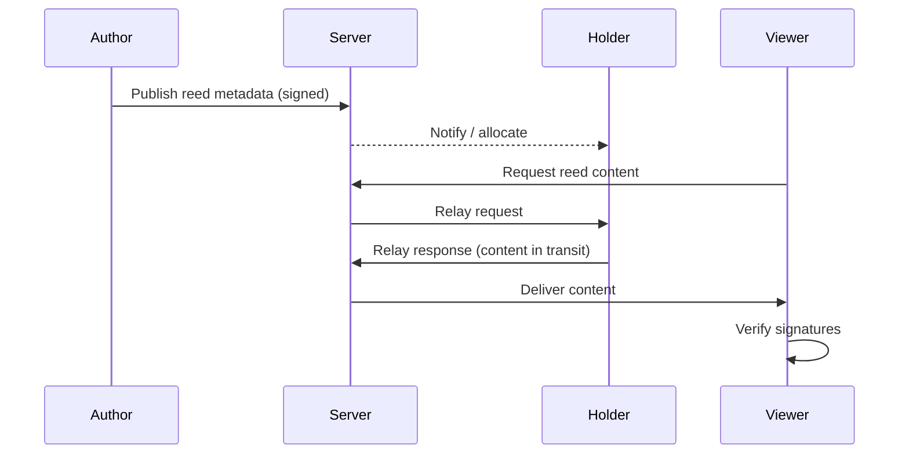

# Architecture

Syrinx is a small stack with a sharp division of responsibility: the server coordinates; devices hold content and keys.

## Components

| Piece | Role |
|-------|------|
| **HTTP API** (Go) | REST: identity, reeds metadata, invites, deletion certs, recovery, server info |
| **Realtime service** (Go) | WebSockets, protobuf events, fanout and catch-up via Go channels |
| **SPA** (SvelteKit) | Primary client / PWA: local keys, IndexedDB, signing, feeds, restore |
| **Ops CLI** (`bin/ops`) | Operator tooling: export/import server identity bundles |

The API and realtime layers run in one process and talk over **in-process Go channels**—not a mesh of microservices. Docker Compose can run Postgres, the API, and the static SPA together.

## The server is a tracker, not a library

Published **reeds** (posts) are authenticated and distributed in a P2P-*ish* fashion:

1. The author signs the reed and registers **metadata** with the server (who wrote what, enough to allocate and notify).
2. The server does **not** keep the body as authoritative content storage. Think tracker: anonymized references and routing, not a media archive.
3. **Holders**—peers that already have the reed—relay the content when someone requests it.
4. Recipients **verify signatures** before trusting or persisting the body.

Most users sit behind NAT, so true peer-to-peer sockets are rare. The server **relays in transit**. That is why this is “P2P-*ish*”: distribution semantics without trusting the server with your corpus.

## Client responsibilities

The SPA is not a thin view over a database. It:

- Holds the user’s **OpenPGP key material** locally
- Signs requests and content
- Stores reeds and peer data it **chose** to keep (see [Content](/content))
- Verifies user and server signatures before applying sensitive updates
- Drives restore and recovery flows when the server must be rebuilt
- Precaches the **app shell** (HTML/JS/CSS) in a service worker so the UI loads offline; reed bodies stay in IndexedDB; API and WebSocket still need the network

## Realtime path

WebSocket sessions authenticate with PGP (detached signatures over a timestamp). Clients subscribe to user-specific and broadcast channels. Events cover new reeds, relay requests/responses, removals, account gone notices, sync catch-up, and related bookkeeping. Missed deliveries are reconciled on reconnect via sync—not by trusting the server’s word alone when certificates are involved.

## Where to go next

- [Trust model](/trust) — who is trusted to attest what
- [Cryptography](/cryptography) — how payloads are signed
- [Content distribution](/content) — feeds, relay, local storage rules
- [Operators](/operators) — running the stack
