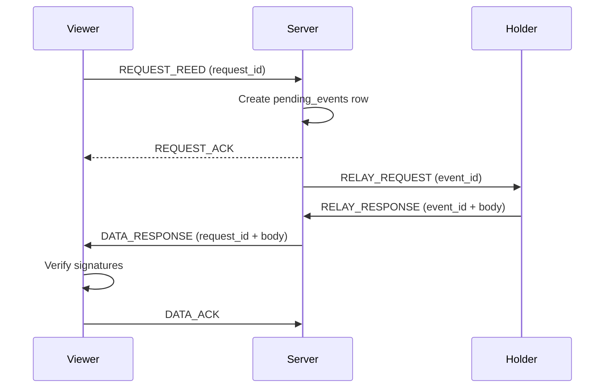

# Content distribution

The unit of publication is a **reed**—a signed post. Distribution separates **metadata** (server) from **bodies** (peers), and separates **ambient delivery** from **what you choose to keep**.

Clients should only **possess** data they **agreed** to hold. Agreement means an explicit action: following someone, or opening a reed. Unsolicited bytes may appear on the wire; they do not earn a permanent home on the device.

## Reeds

Authors compose a reed, sign a canonical payload, and register it with the server. Followers and broadcast subscribers learn that something new exists. Fetching the body goes through the relay path when the viewer does not already hold it.

Server-side reed records bind identifiers important for authenticity (reed id, author id, server signing fingerprint) so countersignatures cannot be replayed across contexts casually.

## Feeds

| Feed | Meaning |
|------|---------|
| **Followcast** | Reeds from people you follow—explicit subscription |
| **Broadcast** | Community-wide traffic you opted to watch |

Syrinx will not invent a “For You” firehose of accounts you never chose. Pagination and finite windows beat infinite engagement scroll.

## How content moves

The server is a **tracker**, not a library. It knows *who holds* a reed and helps peers find each other. Reed **bodies** travel holder → server (in transit only) → requester.

### Explicit fetch (opening a reed)

When you open a reed you do not already hold:

1. The client mints a **`request_id`** and stores it locally (session storage).
2. It sends `REQUEST_REED` with that id, the reed id, and the author id.
3. The server creates a **`pending_events`** row (`event_id` + your `request_id`), then sends `REQUEST_ACK`.
4. The server picks an online **holder** and sends them `RELAY_REQUEST` with the `event_id`.
5. The holder replies with `RELAY_RESPONSE` (body) or `RELAY_MISS` (no longer has it).
6. On a valid response, the server delivers `DATA_RESPONSE` to you, still keyed by your `request_id`.
7. You verify signatures. Success → store (if your storage rules allow) and `DATA_ACK`. Failure → `DATA_INVALID`.

Requests may outlive a single page view. Starting a fetch, navigating away, and returning later is intentional—and helps the mesh move bytes even if you never re-open the reed.

### Follow fanout (new reed from someone you follow)

After the author countersigns and signals `PUBLISH_READY`:

1. The server creates **`pending_events`** rows for online followers who have already sent `SYNC_REQUEST` (they are ready to receive).
2. Those events use the follower’s current sync `request_id`.
3. The same relay path runs: `RELAY_REQUEST` → holder → `RELAY_RESPONSE` → `DATA_RESPONSE` to the follower.
4. The follower verifies and stores. Following was the agreement to keep that author’s reeds.

Catch-up on reconnect uses the same machinery: `SYNC_REQUEST` asks the server to enqueue missing followed reeds (and relevant removals) as pending events.

### Broadcast (ambient)

Subscribers to broadcast may see community traffic without following every author. Those deliveries are **ephemeral**—session storage, not IndexedDB. Opening a broadcast reed can trigger an explicit fetch; only then may verified content move into permanent storage. Ambient flood alone is not a write ticket.

## Abuse guardrails

The relay path is designed so forging or pushing unsolicited content is cheap to ignore. Two layers matter: **server event ledger** and **client correlation / consent**.

### Server: events first, then dispatch

The server does not freestyle WebSocket payloads. Delivery is driven by rows it created:

1. Something legitimate happens (a `REQUEST_REED`, a follow fanout after `PUBLISH_READY`, catch-up after `SYNC_REQUEST`, a removal fanout, …).
2. The server inserts a **`pending_events`** row with a new `event_id` (and the requester’s `request_id`).
3. Only then does it send `RELAY_REQUEST` to a holder, claiming the row (`dispatched_at`).
4. Incoming `RELAY_RESPONSE` / `RELAY_MISS` must cite that **`event_id`**. The server looks up the pending row. No row → no delivery to a viewer; the forged response is a no-op.
5. A successful body delivery goes only to the **requester** recorded on that event—not to arbitrary clients.

So a compromised or malicious peer cannot invent a `RELAY_RESPONSE` and have the server push content somewhere useful. Without a matching pending event, nothing happens.

### Client: only act on requests you started

The client keeps its own copy of the ids it initiated:

1. On `REQUEST_REED`, it stores the **`request_id`** before (or as) it sends.
2. On `REQUEST_ACK`, if the `request_id` is unknown locally, the ack is **discarded**—the client did not start that request.
3. On `DATA_RESPONSE`, the client correlates by `request_id`. If it has no matching outstanding request, it does not treat the payload as a completed fetch it asked for.
4. Follow-path deliveries are gated the same way in spirit: the client sent `SYNC_REQUEST` (and follows the author). That readiness is the agreement to receive catch-up and fanout for people you chose.

If an attacker somehow bypasses the server ledger and pushes unsolicited bodies toward clients, a well-behaved client still **silently drops** anything it never asked for. Possession is not “whatever arrived on the socket.”

### Consent: what “agree” means

| Action | What you agreed to |
|--------|-------------------|
| **Follow** a user | Keep and help relay their reeds (IndexedDB); receive fanout / catch-up for them |
| **Open** a reed | Request that body; after verify, you may keep it |
| **Subscribe to broadcast** | See ephemeral ambient traffic; not a permanent store |

No action → no obligation to hold. Session storage may show broadcast material briefly; IndexedDB is for what you explicitly care about (your data, followed authors, restored backups, reeds you opened and verified).

### Signatures still apply

Guardrails on routing do not replace cryptography:

- Bodies and certificates are verified before trust or permanent write.
- Failed verification → `DATA_INVALID` (and allocation cleanup where the protocol requires it).
- See [Trust](/trust) and [Cryptography](/cryptography).

## Session storage vs permanent storage

Not everything that appears on screen should enter IndexedDB.

- **SessionStorage** (and similar ephemeral stores) can hold ambient broadcast material so a malicious flood cannot permanently poison the local database.
- **IndexedDB** holds what you **explicitly** care about: your own data, followed authors’ content you keep, restored backups, reeds you opened and verified, etc.

Opening a reed you only saw in broadcast can trigger a **request** for the body; successful, verified content may then be kept. Unsolicited delivery alone is not a write ticket to permanent storage.

## History forks and tip checks

Multi-device concurrent publishing can **fork** an author’s reed history: two devices produce divergent tips while the server expects one coherent chain. Until multi-device sync exists, the protocol leans on safeguards:

- Clients report the **last local reed** when creating a new one; mismatch → reject.
- Tip checks treat removed reeds (and account-removed authors) correctly once deletion certificates exist.

**Device binding** (single active device) is the longer-term control plane for “which device may publish,” without putting device ids into the signed public profile.

## Offline-first

Syrinx treats the device as the source of truth for what you keep. If the server disappears, the app and your stored data should still be usable locally—you can export a backup and carry it forward. See [Philosophy — Offline-first](/philosophy#offline-first-you-own-your-data) for why that matters and what moving to another instance does *not* solve yet.

### Authoring while disconnected

Authors can queue work locally (pending publishes, pending removals, pending revocations) and sync when online. The local truth is signed; the server countersigns when it accepts. Retries are designed to be **idempotent** where certificates are involved—see [Deletion](/deletion).

## Related

- [Trust model](/trust#content-consent-and-relay) — consent and forged-event framing
- [Philosophy — Only store what you trust](/philosophy#only-store-what-you-trust)
- [Architecture](/architecture) — tracker / relay role of the server
