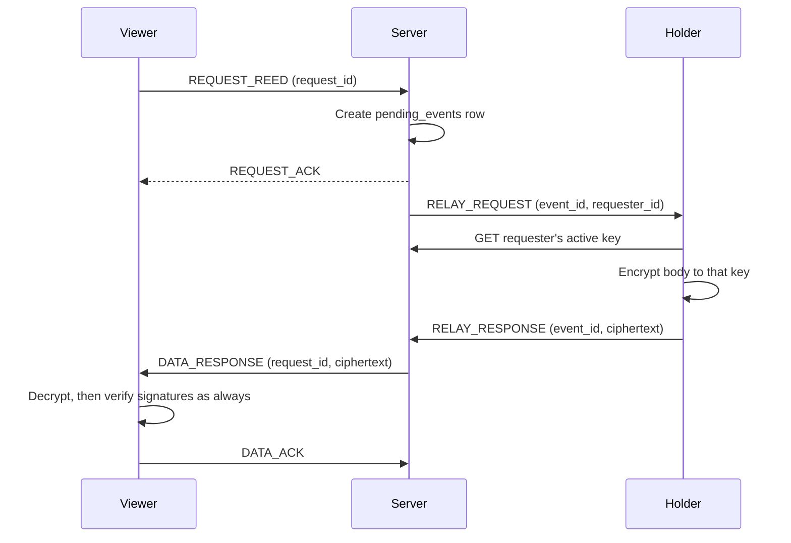

# Content privacy

The server is a tracker, not a library—[Content distribution](/content)
covers that. This page covers the property layered on top: the server
never sees a reed's actual content, not even for a moment, and the bodies
it relays between peers are encrypted so it cannot read them either.

## What changed

Previously the server received a reed's text once, briefly, to check the
author's signature and pull out hashtags before discarding it—never
stored, but visible in transit and in server logs/memory for that one
request. Relayed bodies then moved holder → server → viewer in plaintext.

Now: the author's client never sends the text at all. It sends the
reed's id, structural links (echo/reply target, thread), and *claims*
about the content—which hashtags it carries, who it mentions—so the
server can still route pipe deliveries and mention notifications without
ever reading a word. And when a body does move between peers, the holder
encrypts it to the specific requester's key before handing it to the
server, which relays the ciphertext blindly.

## Threat posture

| We aim to raise the cost of… | How |
|------------------------------|-----|
| A compromised or malicious server operator reading reed bodies | Relay payloads are end-to-end encrypted, holder to requester; the server only ever holds ciphertext, in memory, in transit |
| Forging a reed's content while keeping a valid server attestation | The server countersigns the author's own signature bytes even though it never checks them—swap the content, re-sign it, and the new signature no longer matches what was countersigned |
| A spoofing client routing garbage into a popular pipe | Claimed tags/mentions drive routing, but the receiving client re-derives them from the real (decrypted) content and rejects a mismatch, reporting it as a tracked signal |

| We do **not** claim to stop… | Why |
|------------------------------|-----|
| A holder who already has plaintext keeping a copy | Permanence after display is honest physics—unchanged from [Trust](/trust) |
| A compromised *client* leaking the user's own private key | This is the honest remaining attack surface: unlike a silent server-side leak, a compromised client is visible to anyone auditing the app's own network traffic and code |
| A single bad claim being routed once before it's caught | Trust-but-verify means the first delivery can still reach a watcher; what's raised is the cost of doing this repeatedly without getting flagged |

## How relay encryption works

The server's role in that middle step is unchanged from before this
work—it still creates the pending-event row first, still only delivers to
the requester recorded on that event, still ignores a `RELAY_RESPONSE`
that doesn't cite a real `event_id`. See
[Content distribution](/content#abuse-guardrails) for those guardrails in
full; encryption sits on top of them, it doesn't replace them.

If a holder has the content but can't resolve the requester's key (a
failed lookup), it reports that distinctly from "I don't have this
reed"—the server retries with another holder rather than wrongly
concluding this one's copy is gone.

## Worked example: the swap attack

Say an attacker takes a reed the server already countersigned—a valid
`(reedID, authorID, timestamp)` attestation—and tries to pair it with
completely different, re-signed content, hoping a viewer will accept the
countersignature as proof the server saw and approved this text.

It doesn't work: the server's countersignature covers the *specific
signature bytes* the author originally submitted, not just the id and
timestamp. Re-signing different content produces a different signature
value. A viewer verifying the swapped pair sees the author's signature
matches the (swapped) content, but the server's countersignature no
longer matches that signature—so verification fails and the viewer
discards it. The server never had to read the content to catch this; the
countersignature transitively committed to it anyway.

## Trust-but-verify: tags and mentions

The server cannot check a claimed hashtag or mention against content it
never sees. It routes on the claim—that's how a pipe subscriber or a
mentioned user gets notified at all—and the receiving client is where the
real check happens: re-derive tags/mentions from the decrypted body,
confirm the claim was true, and if it wasn't, tell the server. That
report doesn't undo the delivery or touch the reed; it's a tracked signal
(who authored it, who caught it, why) for the same kind of future
abuse-response work already noted for revoked-key usage in
[Trust](/trust)—nothing automated happens with it yet.

## Related

- [Trust model](/trust) — the broader threat posture this extends
- [Content distribution](/content) — the tracker/relay path this
  encryption layers onto
- [Cryptography](/cryptography) — keys, signatures, the canonical
  envelope this all builds on
