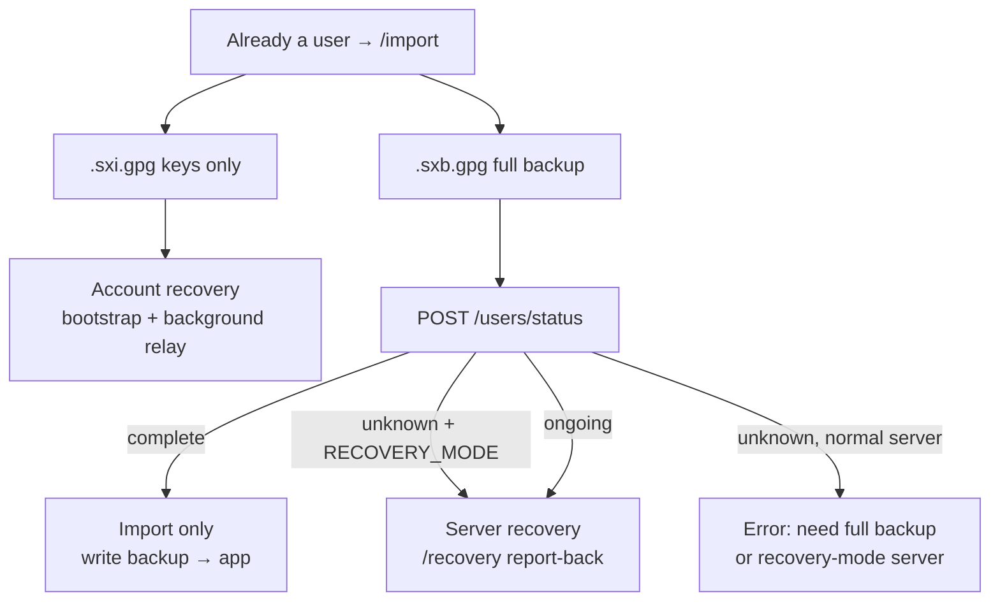

# Identity, invites & recovery

## Identities

User ids are **random and server-scoped**—not guessable counters. Profiles, keys, and related records are **user-signed** and **server-countersigned** so peers can verify both authorship and “this instance witnessed it.”

Username collisions during recovery are resolved by newest server-signed timestamp; losers may be renamed in place. Comfort notifications for that case are a deferred nicety, not a blocker for recovery itself.

## Signup modes

Operators set `SIGNUP_MODE`:

| Value    | Behavior                              |
|----------|---------------------------------------|
| `open`   | Anyone may sign up                    |
| `invite` | Valid invite required                 |
| `closed` | Signup and username checks return 403 |

`MAX_INVITES_PER_USER` caps how many invites a user may mint (`-1` / unset = infinite). `/api/server/info` exposes mode and quota so the SPA can hide Sign Up and disable minting without guessing.

### Signup

New accounts reserve a **user id** from the server before key generation so the OpenPGP identity can embed `userID@serverID` from the start.

1. **`GET /api/users/id`** (unauthenticated) — server mints a random user id, signs it with the current server signing key, and returns `{ userID, signature, fingerprint }`. Nothing is stored in the database; the id and signature are ephemeral until signup completes.
2. **Key generation** — client generates an ECC key pair locally. The OpenPGP user id is cosmetic (the server does not verify it against signed identity bytes): **name** `userID@serverID`, **comment** the server display name from `/api/server/info`, optional **email** from the signup form.
3. **`POST /api/users/signup`** — client sends the usual material (`username`, `publicKey`, self-signature, `userSignature` over the user identity payload) plus `userID`, `userIDSignature` (base64 armored), and `userIDFingerprint` (which server key signed the reserved id). Server verifies the reserved-id signature against that fingerprint’s public key, then creates the profile with that id and countersigns it.

If signup fails after key generation, the client discards the reserved id, keys, and any partial session state so the user can try again.

### Invites

Authenticated users create single-use invite links (subject to quota). Redeeming an invite consumes the token and records a durable countersigned **`invitedBy`** binding on the new account.

The redeem secret is minted and held on the inviter’s device; the server stores only `SHA-256(secret)`. Share links put the secret in the URL fragment so it is not sent on navigation. See [Invites](/invites) for the full flow and threat model.

## Auth day-to-day

After signup or restore, the client holds key material locally. Authenticated HTTP and WebSocket use **signatures**, not a session password checked like a website login form. See [Trust](/trust) and [Cryptography](/cryptography).

## Restore paths at a glance

All returning-user flows start at **Already a user** → **`/import`**. What differs is **what file you have** and **what the server knows**.

Syrinx uses three names internally; as a user you only need the decision table:

| User situation | File | Server state | Name in docs/code |
|----------------|------|--------------|-------------------|
| New device, same healthy server, **keys only** | Identity export `syrinx-….sxi.gpg` (Backup Keys) | Account exists | **Account recovery** |
| New device, same healthy server, **full backup** | Full export `syrinx-….sxb.gpg` | Account `complete` | **Import** (restore) |
| Community DB was wiped; server in rebuild | Full export `syrinx-….sxb.gpg` | `RECOVERY_MODE` / ongoing | **Server recovery** |

This is **not** “switching servers” in the abstract. Moving to another hostname only works if that instance **recognizes your account** (import) or is **explicitly rebuilding** from a wiped database (server recovery). Keys alone never work when the server does not know the account.

### Account recovery (keys only)

Use when the server still has your account but this device has **only** your private keys—not a full local snapshot.

- **Export:** Profile → **Backup Keys** → `syrinx-….sxi.gpg` (encrypted keys + session markers; **no profile in the file**).
- **Import UI:** `/import` → **I only have my keys**.
- **What happens:** prove active key → server returns profile, following, and your reed ids → session works **immediately** → own reed bodies fetch **in the background** from peers (same relay path as normal `REQUEST_REED`).
- **Not:** server recovery. No report-back gate, no progress wall, no waiting to use the app.

If the server returns “account not found,” you need a **full backup** (`.sxb.gpg`), not keys alone.

### Import (full backup restore)

Use when you have a **full encrypted backup** and the server still knows your account.

- **Export:** Profile → full backup → `syrinx-….sxb.gpg`.
- **Import UI:** `/import` → **Full backup**.
- **What happens:** decrypt → `POST /api/users/status` → server says **complete** → write IndexedDB + session locally → normal use. Everything was already in the file.

### Server recovery (DB rebuild)

Use when the **operator wiped or rebuilt the server database** and turned on **`RECOVERY_MODE`**.

- **Same file as import:** full `syrinx-….sxb.gpg` (you need countersigned profile and nested key evidence in the backup).
- **What happens:** after decrypt, status says unknown or ongoing **and** recovery mode is on → backup written locally → **`/recovery`** → claim identity, report peers, reeds, follows, complete. The client reports signed evidence **to** the server; the server is reconstructing its library from the community.
- **Import gate:** until recovery completes, normal API use is blocked (server + client mirror) so half-restored sessions cannot post as if finished.

Keys-only (`.sxi.gpg`) **cannot** drive server recovery—you need the full backup’s countersigned identity nest.

Operator and step-by-step client flow: [Server recovery (hostile takeover / DB loss)](#server-recovery-hostile-takeover--db-loss) below.

## Unified restore (full backup branch)

For **full backups** (`.sxb.gpg`), “I have a backup” and “the server forgot me during recovery” share one picker—the client branches automatically after decrypt:

1. Pick the encrypted backup and its password (`/import` → **Full backup**).
2. Ask `POST /api/users/status` with the countersigned profile: “do you know this user?”
3. Branch automatically:
   - Server knows them → write locally, normal session (**import only**).
   - Server doesn’t, but recovery mode is on → write locally, **claim** identity and report peers/holdings (**server recovery**).
   - Ongoing recovery → resume.
   - Unknown and not recovering → do not write (avoid trapping the user in a broken state).

Users are not asked to pick “Import” vs “Recover” on this branch. **Keys-only** restore is a separate tab (**I only have my keys**); see [Account recovery](#account-recovery-keys-only) above.

## Server recovery (hostile takeover / DB loss)

When an instance must be rebuilt:

### Operator

1. Stand up a new empty database.
2. Ensure the **server key passphrase** is available (keychain or env)—same passphrase that wrapped keys in the backup bundle.
3. Run **`ops import-identity`** on the encrypted identity bundle (`.sxi.gpg`). Bundle password decrypts the file; server passphrase unwraps keys. Restores `serverID`, name, and key history.
4. Start the server with **`RECOVERY_MODE`**. Without a prior successful identity import, boot should refuse.

### Clients

While recovery mode is on:

1. **Own-identity claim** — prove possession of the key chain the old server countersigned (challenge + nested keys).
2. **Peer identities** — report profiles/keys held locally, one at a time; server upserts with newest-wins on server-signed time.
3. **Reeds & follows** — report holdings and follow edges; mark complete.
4. **Import gate** — until complete, the user is barred from normal API use (server middleware + client mirror) so half-restored accounts don’t act like finished logins.

The server never learns private keys. It reconstructs **public, signed** state from the community.

Operators end the window by turning `RECOVERY_MODE` off when the community has reported in sufficiently.

## Device binding

Until multi-device sync exists, concurrent devices can fork history. Device binding aims for **one active device** per user: migrate by binding a new device and retiring the old (wipe app data on the old device—Syrinx does not remotely brick phones). Device ids are **not** part of the signed public profile; they are session metadata, not identity.

## What users should know

- Install / use the PWA thoughtfully: browser extensions can read page data; migrating between “loose tab” and installed app can strand data under browser storage rules.
- Export **full backups** (`.sxb.gpg`) before you need them; export **identity** (`.sxi.gpg` / Backup Keys) if you want a lighter keys-only escape hatch on the same server.
- Invite links are how closed communities grow without harvesting emails.
