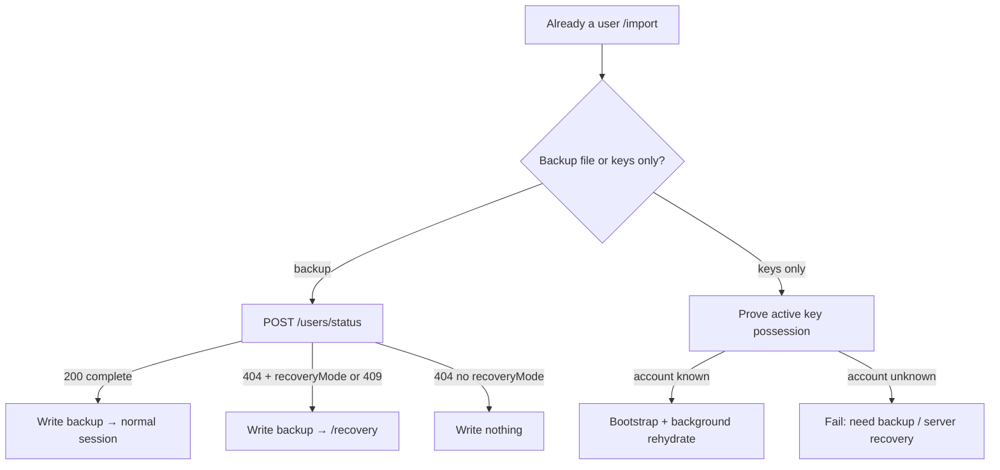

# Account recovery 00 — Design

## Status

Proposed (tip publish rule **accepted**: Approach B — server sends tip id).

## Depends on

—

## Context

Losing a device without a full backup currently means losing a usable
client, even when:

- the user still holds their **private key material**, and
- the **server still knows the account** (profile, key bindings, follow
  edges, reed tip metadata, allocations).

Reed *bodies* live on peers (and on the lost device), not as a server CDN.
The server already tracks who is believed to hold each reed
(`reed_allocations`) and already relays content over the WebSocket. That
is enough to rehydrate a recovering client without inventing a second
distribution system.

Today’s unified restore ([recovery 10](../recovery/10_spa_unified_restore.md))
is **backup-first**: “Already a user” → `/import` → encrypted backup →
status probe → import or server-recovery handoff. Account recovery shares
that entry point and forks when the user provides **keys only** (no backup
file).

## Scope

- Profile **Backup Keys** control that produces the `.sxi.gpg` identity
  backup account recovery consumes ([01](01_key_export.md)).
- Extend the “Already a user” / `/import` surface so the user may submit
  either a full backup **or** that key material.
- Keys-only path: prove possession of the **active** key → install a
  minimal local session from **server-held** state (profile, keys,
  **following**) → rehydrate **own reed bodies** in the background via
  peer relay orchestrated by the server.
- Publish unlocks once bootstrap includes the server tip **id**
  (Approach B); tip **body** restore is background-only for reading.
- Device binding / import: this path **supersedes** older devices
  ([recovery 17](../recovery/17_device_binding.md)).
- Keep server recovery (`RECOVERY_MODE`) on the backup path; keys-only
  does not replace claim + peer report-back.

## Non-goals

- Recovering private keys the user no longer holds (no server-side key
  escrow).
- Reconstructing a wiped server from keys alone (still needs backup /
  peer-held countersigned evidence under `RECOVERY_MODE`).
- Restoring cached peer profiles, tags, echo-count caches, or other users’
  reeds.
- Restoring a local **followers** list (users do not have that information
  today; fanout stays server-side).
- Restoring invite redeem secrets (mint / revoke anew).
- Restoring local-only queues (`unsignedReeds`, `pendingFollows`,
  `pendingRemoval`, …).
- Accepting a revoked or superseded private key for proof (compromised by
  definition of revoke).
- A second content plane besides existing relay / `RELAY_REQUEST` /
  `DATA_ACK` machinery.

## Design

### Identity backup (companion)

Profile **Backup Keys** exports a small identity backup (`.sxi.gpg`) — same
encrypted backup pipeline as full export, minimal payload: active key,
countersigned profile, identity localStorage subset
([01](01_key_export.md)).

- Protect the file with a passphrase chosen at export time.
- Filename: `syrinx-<userID>-<timestamp>.sxi.gpg`.
- Copy should stress this file carries account identity + keys; prefer a
  full `.sxb.gpg` backup when possible.

### Entry and fork

Homepage CTA remains **“Already a user”** → `/import`.

The form accepts **one** of:

1. **Full backup** — existing path: decrypt → `POST /api/users/status` →
   write backup → normal session or server-recovery handoff.
2. **Identity only** — `.sxi.gpg` from Backup Keys + passphrase. Account
   recovery path ([04](04_spa_keys_only_restore.md)).

Presence of a backup file vs key material selects the branch. Warn that
continuing **logs the user out of other devices** (same posture as backup
import once [17](../recovery/17_device_binding.md) ships).

### What the user brings

- The **identity backup** (`.sxi.gpg`) or full backup file.
- Passphrase to decrypt it.

Parse key → fingerprint + `userID` (OpenPGP uid `userID@serverID`) →
confirm `serverID` matches this instance.

**Active key only.** A revoked key must not authenticate account recovery:
revocation means that material may be compromised.

### Proof of possession

The account already exists on the server — this is **device rebind +
session bootstrap**, not `RECOVERY_MODE` own-identity claim:

1. Short-lived challenge from the server (non-`RECOVERY_MODE` route).
2. Client signs with the unlocked **active** private key.
3. Server matches fingerprint to the on-record **active** public key;
   rejects revoked / unknown / non-active fingerprints.
4. On success: **revoke other devices + bind this one** (when 17 ships),
   return bootstrap payload.

Idempotent retries OK. Failures write nothing durable.

### Minimum operating set

| Need | Source | Why |
|------|--------|-----|
| Active private key + unlock passphrase | User input | Request signing, authorship |
| `userId`, active fingerprint | Key + server confirm | Session markers |
| Own countersigned **profile** | Server | Own identity locally |
| Own **public** keys / revocations on record | Server | Local key stores |
| **Following** edges | Server (`user_following`) | Local `following` store |
| Own tip **id** (+ tip catalog for rehydration) | Server (`reeds`) | Publish `previousID` (Approach B) / what to fetch |
| Own reed **bodies** (tip first) | Peers via relay | Reading own history; not required to publish |

**Not** restored: peer profiles, followers list, others’ reeds, invites,
caches, pending queues.

### Bootstrap payload (server → client)

After proof:

1. Countersigned own profile.
2. Public key material / revocations (or fetch via existing endpoints).
3. Full **following** id list (paged; ≤100 per page is fine).
4. **Current tip id** (or explicit genesis / empty-tip signal) plus the
   catalog of own tip rows to rehydrate (exclude removal tombs),
   including per-reed allocation hints if useful. The tip id alone is
   enough for `previousID`; bodies are not part of the publish gate.

Client writes keys, session, profile, following; opens the normal app
shell; starts **background** rehydration. A local run marker tracks
progress; it does **not** trap the user on a blocking progress-only
screen.

### Rehydration (background)

Server-orchestrated, existing realtime path:

1. Mark user **rehydrating** (dedicated row; **not**
   `ongoing_recoveries` / not gated on `RECOVERY_MODE`).
2. **Prioritize the tip** in the relay queue, then other own reeds with
   ≥1 allocation (prefer online holders; skip pure self-only allocations
   as sources — the recovering device no longer holds the body).
3. Client verifies, `storeReed`, `DATA_ACK` as usual.
4. `RELAY_MISS` → drop holder, try another ([publish 02](../publish/02_relay_miss.md)).
5. Non-tip reeds keep filling in after publish is unlocked; no need to
   wait for full history.

Restore **only own reeds** (+ following already applied at bootstrap).

### Publish gate: tip id from the server

- App use (browse, follow, open profiles, fetch others) is allowed after
  bootstrap.
- **Compose / publish** unlocks once bootstrap has supplied the tip **id**
  (Approach B, accepted below). The tip **body** is not required to
  publish.
- Older own reeds may still be missing; that does not block publish.
- Own reed bodies (tip first) still rehydrate in the background for
  *reading* history.

### Why publish cares about the tip

Live publish is gated by a **tip check**
([recovery 16](../recovery/16_reed_tip_check.md)): on `POST /reeds` the
client sends `previousID`, and the server accepts the create only if that
id is the author’s current tip (newest non-removed reed by server
`signed_at`, then `id`), or if the author has **zero** reeds and
`previousID` is empty (genesis).

**Why that gate exists.** Without it, two clients that both hold the same
active key (two tabs, two restored devices before binding catches up, a
stolen key still usable) can each `POST /reeds` successfully. Each create
is independently countersigned. The author’s history then **forks**: two
reeds both honestly “extend” the same prior tip, and there is no
protocol-level winner—only a bag of tips ordered by server time. Device
binding ([recovery 17](../recovery/17_device_binding.md)) reduces how often
that happens (one active device), but it is **session policy**, not an
application invariant: dual-tab on the same device, races around rebind,
and “history should stay linear even if policy fails” are why 16 exists
alongside 17.

**What the tip check needs.** Only the tip **id** (and that it matches the
server). It does **not** need the tip **body**. Bodies matter for reading
your own latest post and for the SPA’s usual rule “local tip = newest
countersigned reed I hold.” Account recovery often has the id from
bootstrap long before any peer can relay the body—or forever, if nobody
else held it.

**Why account recovery collides with this.** The tip is the newest reed,
so it often has the **fewest** allocations. Worst case: create allocated
only the author; the device dies before any peer `DATA_ACK` → **no peer
holds the body**. Relay cannot resurrect it. Under tip-check, the next
publish must still name that tip id as `previousID`. Empty `previousID`
while tips exist is exactly the fork/orphan path 16 forbids.

The approaches below are different answers to: *how does a recovering
client get a correct `previousID` (and when may they publish)?* One of
them asks whether we should stop requiring `previousID` at all.

### Approach A — Wait forever for the tip body

**Rationale.** Keep the normal client rule unchanged: tip = latest
countersigned reed in local IndexedDB. Publish only when that local tip
equals the server tip, which in practice means the tip body has been
relayed and stored.

**Pros**

- One tip rule everywhere; no special “server said so” previousID.
- User never publishes while believing their latest post is missing if it
  might still arrive.

**Cons**

- If the tip has no remaining peer holders, publish is **blocked
  forever**.
- Couples publish availability to content availability, even though
  tip-check only needs an id.
- Worst UX precisely when the tip is newest / least replicated.

**Verdict.** Rejected as the sole policy; too brittle for key-only
restore.

### Approach B — Server sends the tip id (accepted)

**Rationale.** Tip-check only needs an id. The account-recovery bootstrap
already knows the author’s current tip from server metadata. **Send that
id to the client** and have the recovering client use it as `previousID`
on the next create. The tip **body** is irrelevant to satisfying the
gate: missing content is a hole in the local timeline, not a reason to
block compose.

Rehydration still prioritizes fetching the tip body (then other own
reeds) in the background so the user can *read* their latest post when
peers still hold it. That work must not gate publish.

**Pros**

- Preserves tip-check / linear history without inventing a second publish
  protocol.
- Unblocks publish as soon as bootstrap completes — even when the tip had
  only the lost device as holder.
- One clear rule: `previousID` comes from the server tip id until the
  client’s own newer create becomes the tip.
- Matches “only the tip (id) is necessary to begin publishing.”

**Cons**

- Client may send `previousID` for a reed it does not hold locally.
- Local timeline can have a hole at the tip until (unless) relay
  succeeds; UI should admit when content could not be recovered.
- Slightly different tip source than a normal session (server catalog vs
  “newest reed in IndexedDB”) until the first successful post-recovery
  create.

**Accepted rule**

1. Bootstrap includes the current tip id (or an explicit empty/genesis
   signal when the author has no tips).
2. Client stores that id as the publish tip and may open compose
   immediately after bootstrap.
3. On `POST /reeds`, send that id as `previousID` (omit only for true
   genesis).
4. Background rehydration still schedules the tip body first for reading;
   exhaustion / missing body never clears server tip metadata and never
   blocks publish.
5. After the user successfully creates a new reed, local tip tracking
   returns to the normal “newest countersigned local reed” rule.

### Approach C — Same as B, framed as “wait for body first”

**Rationale.** An earlier draft of B preferred unlocking only after the
tip **body** arrived, falling back to the server tip id when holders were
exhausted. That still ends at “use the server id,” but adds a waiting
state while relay runs.

**Pros**

- Slightly higher chance the user sees their latest post before composing.

**Cons**

- Extra state machine for no protocol gain (tip-check never needed the
  body).
- Delays publish whenever holders are slow or offline, even though the id
  was already known at bootstrap.

**Verdict.** Rejected in favor of Approach B as stated: **just send the
id from the server**; body restore is background-only.

### Approach D — Empty `previousID` if the tip never comes back

**Rationale.** Treat “I could not restore my tip” like genesis: publish
with no previous id so the user is never stuck.

**Pros**

- Unblocks publish with no special previousID plumbing.

**Cons**

- If the server still has tip metadata, empty `previousID` is exactly a
  **fork / reject** under tip-check (16).
- If the server were changed to accept it, the new reed would not extend
  the real tip—history splits or the old tip is orphaned from the
  author’s live chain of creates.
- Teaches the client a lie (“I have no reeds”) when the network still
  knows otherwise.

**Verdict.** Rejected.

### Approach E — Delete tip metadata when the body is unrecoverable

**Rationale.** If no peer can produce the body, drop the tip row (or
pretend it was removed) so the previous reed becomes tip or genesis
applies—then normal tip-check works with whatever the client holds.

**Pros**

- Client tip and server tip converge without a server-supplied previousID.

**Cons**

- Server tip metadata is a **witnessed** countersigned fact. Deleting it
  because *this* client cannot fetch the body lies about history.
- Other holders may still have the reed; allocations / coverage /
  permalinks / echoes can still refer to it.
- Conflicts with deletion’s signed-removal model (author-attested
  removal, not “lost my copy”).

**Verdict.** Rejected.

### Approach F — Abolish the tip requirement for publish

**Rationale.** Account recovery’s pain is almost entirely “I must name
the tip to create.” If `POST /reeds` no longer required `previousID` (or
ignored it), a recovering client could publish immediately after
bootstrap with **no** tip body, **no** tip id, and **no** exhaustion
logic. Approaches A–E shrink to “rehydrate own reeds when you can; publish
whenever.”

That is not a small local exception. It means **not shipping** tip-check
(16), or shipping it and then gutting the invariant it was written for.

#### What we would gain

- Account recovery publish path becomes trivial: keys → prove → bootstrap
  → compose.
- No deadlock when the tip had only the lost device as holder.
- No server-supplied `previousID`, no tip-waiting UI.
- One less concept for clients to get wrong during restore.

#### What tip-check was buying (cost of removal)

| Risk | With tip-check (16) | Without tip-check |
|------|---------------------|-------------------|
| Two tabs publish at once | One wins; other gets `reed_fork`, refreshes tip | **Both succeed** → two tips for one author |
| Two devices before / despite binding | Same hard gate | Both succeed until/unless 17 rejects the socket |
| Stolen key posting while victim still online | Victim’s next create forks or loses the race cleanly | Parallel histories both look valid |
| “What is my latest reed?” | Server tip is well-defined; clients converge via `previousID` | Latest = newest `signed_at` only; concurrent creates are siblings, not a chain |
| Dual-tab on **one** bound device | Covered by 16 | **Not** covered by 17 (same device id) |

Device binding alone does **not** replace tip-check:

- 17 stops a *second device id*; it does not serialize two creates from
  the **same** active device (two tabs, two workers).
- Binding is enforced after auth; tip-check is the create-time
  transactional lock that makes “who extends the tip” singular.
- Policy state can be wrong after DB rebuild / clock skew / bugs; an
  application-level previousID check still keeps append linear when the
  server’s tip row is intact.

#### Ramifications beyond account recovery

- **Author timeline model.** Today’s intended model (once 16 lands) is an
  append-only tip chain at create time. Without it, the author’s reeds
  are a **time-ordered set**. UIs that assume a single “latest” for
  compose, local queues, or “publish after this” semantics must treat
  conflicts as normal, not exceptional.
- **`reed_fork` UX.** Goes away—along with a clear signal that the client
  was stale. Stale clients just create divergent tips.
- **Unsigned / offline queues.** Two queued publishes that both believed
  they followed the same local tip both countersign successfully;
  reconciliation is “whatever the server stamped,” not “one rejected.”
- **Account recovery.** Wins simplicity; loses a shared invariant with
  live clients. Recovery would no longer need Approaches A–E for
  *publish*; it would still want tip-first relay for *reading* your
  latest post.
- **Deletion / echoes / refs.** Still key off concrete reed ids; they do
  not require a tip chain. Cost is linearity of **creates**, not link
  integrity of refs.
- **Server recovery / tip catalog.** Unrelated: reporting historical tip
  metadata during `RECOVERY_MODE` does not depend on live previousID.

#### Partial weakenings (not full abolish)

- Exempt only account-recovery sessions from previousID → two code paths;
  a recovered client that stays exempt forever weakens the invariant; a
  recovered client that suddenly requires tip later reintroduces the same
  missing-body problem on first publish.
- Require previousID only when the client holds ≥1 own reed → recovering
  clients with empty local history could omit it while the server still
  has tips → same as Approach D (fork), unless the server special-cases
  “empty local” which cannot be trusted (client-claimed).

So “just don’t require the tip for recoverers” either collapses into
abolishing the gate for everyone that can pretend to be empty, or becomes
a forgeable exemption.

#### Verdict on F

Abolishing tip-check **does** dissolve the account-recovery publish
blocker, at the cost of **accepting forked author histories** whenever
two creates race—including mundane dual-tab cases device binding cannot
see. That is a global product/protocol decision, not an account-recovery
tweak. **This design keeps tip-check and accepts Approach B**: the server
sends the tip id; the client uses it as `previousID`. Revisit F only if
the project explicitly drops or defers
[recovery 16](../recovery/16_reed_tip_check.md) for everyone.

### Interaction with existing restore paths

| Situation | Path |
|-----------|------|
| Has backup, account `complete` | Import only |
| Has backup, `RECOVERY_MODE` / `ongoing` | Server recovery report-back |
| Keys only, account known | **Account recovery** (this doc) |
| Keys only, account unknown | Fail — need backup |
| Keys only + wiped DB needing claim | Out of scope — need countersigned nest from backup / peers |

### Threat notes (short)

- Active private key possession **is** account control; identity backup
  (Backup Keys / `.sxi.gpg`) and account recovery make that explicit.
- Challenge short-lived and server-bound; only the active on-record key
  verifies.
- Rehydration targets only the authenticated user id.
- Import / account recovery **supersedes** older devices.

## Resolved

1. **Identity backup** (Backup Keys → `.sxi.gpg`) for account recovery
   ([01](01_key_export.md)); same encrypted backup payload, smaller subset.
2. **Following only** — no followers list to the client.
3. **Tip-check stays** — publish still names `previousID`
   ([recovery 16](../recovery/16_reed_tip_check.md)). Abolishing the tip
   requirement (Approach F) is explored and rejected for this feature:
   it would fix restore publish deadlock only by accepting forked author
   histories (including dual-tab), which device binding does not fully
   cover.
4. **Account-recovery publish tip (Approach B, accepted)** — bootstrap
   **sends the current tip id** from the server; the client uses it as
   `previousID`. The tip **body** is not required to unlock compose; body
   restore is background-only for reading. Reject waiting forever on the
   body (A), waiting-for-body-then-fallback (old C), empty `previousID`
   (D), and deleting tip metadata (E).
5. **Background rehydration** — normal app after bootstrap; publish gated
   only on having the server tip id (or genesis).
6. **Active key only** — never accept revoked keys for proof.
7. **Device takeover** — same as import: supersedes older devices.
8. **Scope of content** — own reeds + following only.
9. Distinct from `RECOVERY_MODE` / `ongoing_recoveries`.

## Open questions

None blocking implementation steps. Resolved in steps:

1. **Identity export** → [01](01_key_export.md) (`.sxi.gpg`, existing backup payload).
2. **Missing tip body UX** → [05](05_spa_rehydration_publish.md) (quiet
   banner; no modal wall; keep previousID).
3. **Challenge routes** → [02](02_challenge_bootstrap.md)
   (`/api/account-recovery/challenge` + `bootstrap`).

