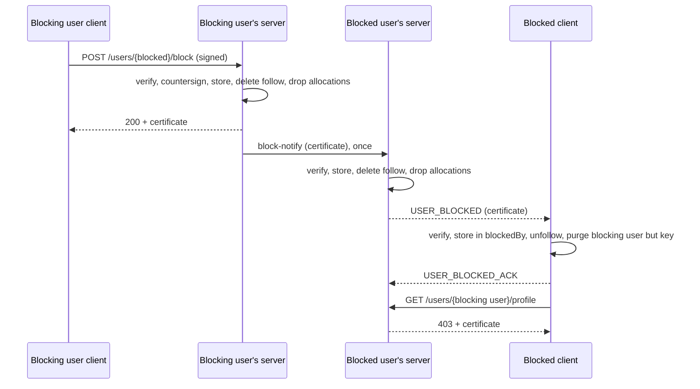

# Blocking 00 — Design, trust model, locked decisions

## Status

Proposed.

## Depends on

—

## Today

There is no way for a user to keep another user out. Anyone on the server,
or on a peer, can open any profile, page through its reeds over
`SUBSCRIBE_PROFILE` / `PROFILE_PAGE`, and fetch any reed body with
`REQUEST_REED`. The only per-user tools are unfollowing and, on the client,
evicting a stored user (`/account/storage`), which affects only what the
viewer holds, not what others can see of them.

## Terms

- **Blocking user** — the user who blocks.
- **Blocked user** — the user who is kept out.
- **Block certificate** — the blocking user's detached signature over the block
  payload plus the blocking user's home server countersignature. The only thing a
  client or peer trusts as evidence of a block.
- **Blocking user's server** — the blocking user's home server; source of truth.
- **Blocked user's server** — the blocked user's home server. The same
  server when both are local; a peer otherwise.

## Model

1. The blocking user signs the block payload and `POST`s it to
   `/users/{blockedUserID}/block`.
2. The blocking user's server verifies it, countersigns it once, stores it, and in
   the same transaction deletes the blocked user's follow of the blocking user
   and drops their allocations of the blocking user's reeds.
3. If the blocked user is local, the server pushes `USER_BLOCKED` with the
   certificate to them (now, or on catch-up). If they are on a peer, it sends
   the certificate once to that peer, which stores it, does the same
   server-side cleanup for its user (including its own copy of the
   follow), and pushes `USER_BLOCKED` to them.
4. The blocked client verifies the certificate against the blocking user's key,
   stores it in `blockedBy`, acks it, and drops the blocking user's reeds,
   profile and info, and unfollows the blocking user locally: the `following`
   row, pending follows and every list membership go, as on a manual
   unfollow. It keeps only the key.
5. From then on, both servers refuse the blocked user anything of the
   blocking user's: **403** + certificate over HTTP, `USER_BLOCKED` + request ID
   over WS.
6. The blocked user opens the blocking user's profile and immediately sees, from
   `blockedBy`, that they are blocked, with **Block** / **Unblock** for their
   own block of the blocking user and no **Follow** / **Unfollow**. From
   **Stored users** they may evict the block: the client drops the
   certificate and the key. Opening the profile again gets the **403** +
   certificate, the key is fetched to verify it, and both are stored again.
7. The blocking user unblocks with an unsigned `DELETE`. The row goes, the
   blocked user's server is told, and the blocked client gets
   `USER_UNBLOCKED` and drops its certificate. Nothing comes back: not the
   follow, not list memberships, not content.



## What a block refuses

Everything that would show the blocked user the blocking user, wherever it is
asked:

| Path | Answer to the blocked user |
|------|----------------------------|
| `GET /users/{blocking user}/profile`, `/info` | 403 + certificate |
| `GET /reeds/{blocking user}/{reedID}` and its echoes/replies/chorus/ripples | 403 + certificate |
| `GET /users/{blocking user}/following`, `/followers`, `/vouches` | 403 + certificate |
| `REQUEST_REED`, `REQUEST_THREAD` for the blocking user's reeds | `USER_BLOCKED` + request ID |
| `SUBSCRIBE_PROFILE`, `PROFILE_PAGE` for the blocking user | `USER_BLOCKED` + request ID |
| `SUBSCRIBE_REED` on a blocking user's reed | `USER_BLOCKED` + request ID |
| Fanout of the blocking user's reeds (follow, broadcast, pipe, reply, mention, echo) | not dispatched |
| User search | the blocking user is left out |

`/keys/{id}` stays open: the blocked user needs the blocking user's key to verify
the certificate.

Interactions the other way (the blocked user following, liking, rippling,
replying to, echoing or mentioning the blocking user) are refused in
[06](06_interactions.md). **Blocking back is never refused**: the blocking user
can still see the blocked user by default, and the blocked user may close
that too.

## The blocked profile page

```
  ┌───────────────────────────────────────────┐
  │ [identicon]  alice@a.example              │
  │                                           │
  │ alice blocked you on 8 Oct 2026.          │
  │ You can't see their profile or reeds.     │
  │                                           │
  │ [Block]                                   │
  └───────────────────────────────────────────┘
```

- Rendered from the local `blockedBy` certificate alone, offline, with no
  profile or reeds; the identicon and user ID stand in for the dropped
  profile.
- No **Follow** or **Unfollow**: the block already unfollowed, and the
  server would refuse a new follow.
- **Block** / **Unblock** reflects the viewer's own block of the blocking user.
  The blocking user can still see the viewer's profile by default; blocking back
  closes that too. The two blocks are independent: either side lifting
  theirs leaves the other in place.
## Trust model

- **Clients verify, never trust a push.** A certificate is accepted only
  if the blocking user's signature verifies against the blocking user's key and the
  countersignature verifies against the blocking user's server key selected by
  fingerprint. A server cannot make a client believe it was blocked without
  the blocking user's signature.
- **The countersignature binds identity**: `userID`, `blockedUserID`, the
  blocking user's key ID (inside the signed user payload), the server key
  fingerprint and the server timestamp ([shared conventions](../README.md)).
- **Enforcement is a server matter.** The certificate tells the blocked
  client why it is refused; it is not what refuses it. A server that ignores
  a block can show the blocked user the blocking user anyway — content lives on
  devices and a holder can always hand it over. Blocking raises the bar from
  "open the profile" to "run or collude with a misbehaving server"; it is
  not secrecy. The blocking user's server enforces on everything it serves, so a
  peer that ignores the block still has to get the content some other way.
- **A peer vouches for who is asking**, as it already does for follows
  (`followerID`). A peer that lies about the requester can bypass a block
  on the blocking user's server; it could equally pretend to be any of its users,
  so this adds nothing new.
- **Unblock is unsigned.** Lifting a block gives nobody evidence to keep.
  The worst a server can do by inventing an unblock is stop enforcing,
  which it can already do by ignoring the block.

## What a block may force

A block may force two things on the blocked user:

- **Deleting the blocking user's data**: reeds, profile, info. It was the
  blocking user's, held on loan.
- **Unfollowing the blocking user.** A follow is not a signed record
  (`user_following` is an authenticated insert, vouched for by the peer
  across servers), so deleting it forges no signature. Keeping it would
  leave the blocked user in the blocking user's followers and the blocking user in the
  blocked user's following and lists. The client cleanup is the same one a
  manual unfollow runs, list memberships included.

Nothing the blocked user **signed** is touched: their reeds, replies,
echoes, likes, ripples and mentions stay until they remove them. New ones
aimed at the blocking user are refused ([06](06_interactions.md)). Dropping the
blocked user's `reed_allocations` of the blocking user's reeds is the server's own
routing bookkeeping.

Unblocking restores none of it. The blocking user is told this before blocking
([08](08_spa_blocking_user.md)).

## Why the blocked client keeps the key

The certificate is worthless without the key that verifies it, and the
key is what lets the blocked user see, at a glance and offline, why the
profile is closed. Keeping it also keeps the blocked user's
`public_key_allocations` row, so a later revocation of that key still
reaches them. Everything else of the blocking user's is content the blocked user
is no longer meant to have.

## Why evicting the block is allowed

The certificate is the blocked user's own data on their own device, and it
takes space like anything else held of another user. Evicting it from
**Stored users** removes it with the key; the server still enforces the
block, and hands the certificate back the moment they ask for something of
the blocking user's, so eviction hides nothing they could not see again.
There is no separate action for it on the profile: there, the server would
answer with the certificate at once.

## Non-goals

- **Muting** (the blocking user hiding the blocked user from themselves). The
  blocking user can unfollow and evict them already.
- Hiding that a block exists. The blocked user is told, by design.
- Removing the blocked user's existing replies to, echoes of or mentions of
  the blocking user's reeds. They stay; new ones are refused ([06](06_interactions.md)).
- Server-wide or admin blocks, and blocking whole servers.
- Blocking with a reason or note.

## Open questions

1. Should blocking also delete the **blocking user's** follow of the blocked
   user? Most platforms do. Locked as no for now: the block is one
   direction, and the blocking user can unfollow.
2. Should a blocked user still be able to find the blocking user in search and
   be told they are blocked, rather than not finding them? Locked as "left
   out"; the profile link still works and still answers 403.
