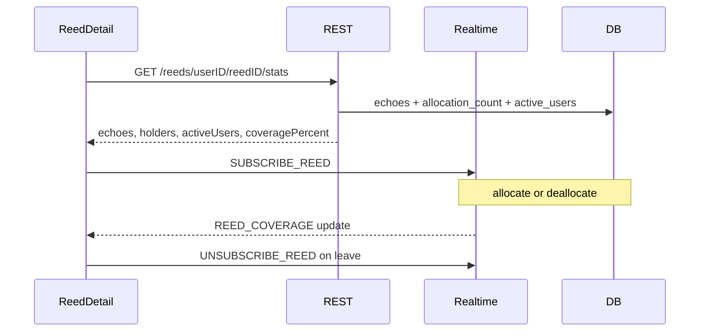

# Coverage 00 — Design + UX + formula

## Status

Proposed.

## Depends on

—

## Context

`reed_allocations` records the server’s belief that a user **holds** a reed’s
content (author seed on publish, recovery report, or `DATA_ACK` after
delivery). That table drives relay and deletion catch-up; it is not
cryptographic proof of possession.

There is no product surface today for “how many users have this reed.” Reed
detail already shows a tiny echoes count (“stats for nerds”). Coverage sits
beside that.

Reed detail does **not** subscribe to per-reed WS updates today — only local
load / one-shot `REQUEST_REED`. Allocation writes are silent.

## Scope

- Define **held**, **active users**, and **coverage percent**.
- Lock UX placement and privacy.
- Outline REST snapshot + live subscription (details in 01 / 02).

## Non-goals

- Cross-instance / federated coverage.
- Attested or client-reported possession (allocations stay operational).
- Changing relay, catch-up, or allocation insert rules beyond counter bumps.
- Listing holder user IDs to clients.
- Replacing echo semantics or conversation UI
  ([conversations](../conversations/README.md)).

## Design

### Terms

- **Held** — a row exists in `reed_allocations` for `(holder_user_id, reed_id)`.
- **Holders** — count of such rows for a given `reed_id` (author counts once
  they are allocated, which they are at publish).
- **Active users** — rows in `users` with **no** corresponding
  `account_removals` row. Not “currently online.”
- **Coverage** — `holders / activeUsers`, expressed as an integer percent.

### Formula

```
coveragePercent = floor(100 * holders / activeUsers)   // when activeUsers > 0
coveragePercent = 0                                      // when activeUsers == 0
```

Server computes and returns `coveragePercent` on REST and WS so clients do
not diverge on rounding. Cap is natural: `holders` should never exceed
`activeUsers` under correct allocate/remove accounting; if it transiently
does, still use the formula (may show `>100` only if buggy — prefer clamping
to `100` in the handler as a safety rail).

### Privacy / audience

Any **authenticated** user who can open the reed detail page may read
coverage for that reed (REST + subscribe). No author-only gate. Unauthenticated
requests are rejected like other reed APIs.

Coverage reveals an aggregate, not who holds the reed.

### UX

On the reed detail page, in the existing tiny stats line (published reeds
only; hide while pending / unsigned):

```
[megaphone] N    [cloud-line-chart] P%
```

Asset paths (SPA static):

| Stat | Icon |
|------|------|
| Echoes | [`/icons/megaphone-16.png`](../../spa/static/icons/megaphone-16.png) |
| Coverage | [`/icons/cloud-line-chart-16.png`](../../spa/static/icons/cloud-line-chart-16.png) |

- Both icons are black PNGs — render with CSS `mask-image` + `background-color: currentColor` (same pattern as the current echoes stats line) so they pick up `--muted`.
- Small, muted, monospace-adjacent styling (same “stats for nerds” voice).
- `N` = echo count; `P%` = `coveragePercent`.
- Do not put coverage on the Echo action button.
- Pending local reeds: no stats line (no server tip yet).

### Data path (overview)



1. On open (published reed): `GET …/stats` once.
2. Subscribe to the reed; apply live coverage updates.
3. On leave / destroy: unsubscribe.

### Counters (why redundant)

Hot paths (every `DATA_ACK` allocate/deallocate) must not
`COUNT(*)` all users or all holders to emit WS updates. Maintain:

- Per-reed **allocation count** next to tip metadata.
- Network **active user** count.

Bump both in the **same transaction** as the underlying write (see 01).

## Open questions

None — product decisions locked in the [README](README.md).
