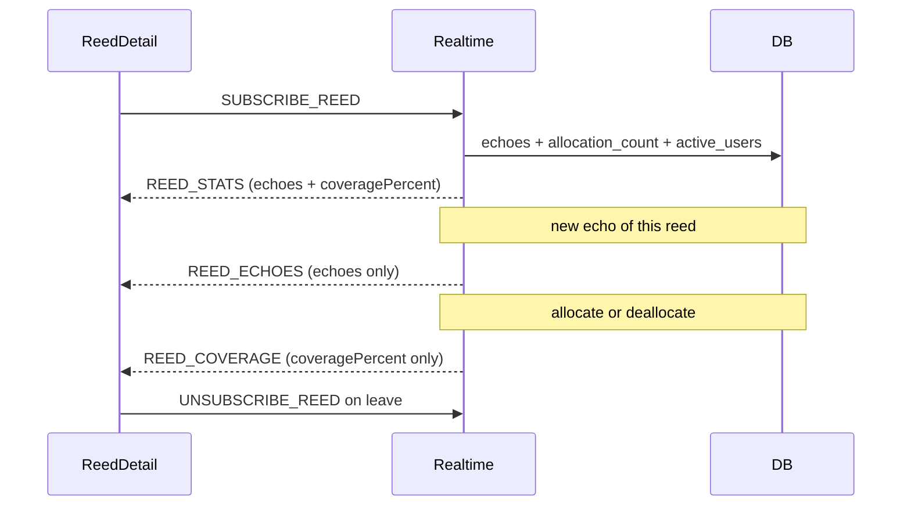

# Coverage 00 — Design + UX + formula

## Status

Implemented.

## Depends on

—

## Context

`reed_allocations` records the server’s belief that a user **holds** a reed’s
content (author seed on publish, recovery report, or `DATA_ACK` after
delivery). That table drives relay and deletion catch-up; it is not
cryptographic proof of possession.

Reed detail shows a tiny “stats for nerds” line: echo count and coverage.
Those values must stay in sync while the page is open without a second
HTTP channel for the same data.

## Scope

- Define **held**, **active users**, and **coverage percent**.
- Lock UX placement and privacy.
- Lock **WS-only** delivery: subscribe → snapshot ACK → independent live
  updates (details in [01](01_counts.md) / [02](02_reed_subscription.md)).

## Non-goals

- Cross-instance / federated coverage.
- Attested or client-reported possession (allocations stay operational).
- Changing relay, catch-up, or allocation insert rules beyond counter bumps.
- Listing holder user IDs to clients.
- Replacing echo semantics or conversation UI
  ([conversations](../conversations/README.md)).

## Design

### Terms

- **Held** — a row exists in `reed_allocations` for `(holder_user_id, reed_id)`.
- **Holders** — count of such rows for a given `reed_id` (author counts once
  they are allocated, which they are at publish).
- **Active users** — rows in `users` with **no** corresponding
  `account_removals` row. Not “currently online.”
- **Coverage** — `holders / activeUsers`, expressed as an integer percent.

### Formula

```
coveragePercent = floor(100 * holders / activeUsers)   // when activeUsers > 0
coveragePercent = 0                                      // when activeUsers == 0
```

Server computes and returns `coveragePercent` on WS so clients do not
diverge on rounding. Clamp to `100` max as a safety rail if holders
transiently exceed active users.

### Privacy / audience

Any **authenticated** user who can open the reed detail page may subscribe
and receive stats for that reed. Coverage reveals an aggregate, not who
holds the reed.

### UX

On the reed detail page, in the existing tiny stats line (published reeds
only; hide while pending / unsigned):

```
[megaphone] N    [cloud-line-chart] P%
```

| Stat | Icon |
|------|------|
| Echoes | [`/icons/megaphone-16.png`](../../spa/static/icons/megaphone-16.png) |
| Coverage | [`/icons/cloud-line-chart-16.png`](../../spa/static/icons/cloud-line-chart-16.png) |

Black PNGs → CSS `mask-image` + `currentColor` / `--muted`. Small, muted
“stats for nerds” voice. Do not put coverage on the Echo action button.

### Data path (overview)



1. On open (published reed): `SUBSCRIBE_REED`.
2. Server replies immediately with both stats.
3. Later: echo-only or coverage-only events as each value changes.
4. On leave: unsubscribe.

### Counters (why redundant)

Hot paths must not `COUNT(*)` all users or holders to emit WS updates.
Maintain per-reed `allocation_count` and network `active_users` in the
**same TX** as the underlying write ([01](01_counts.md)).
