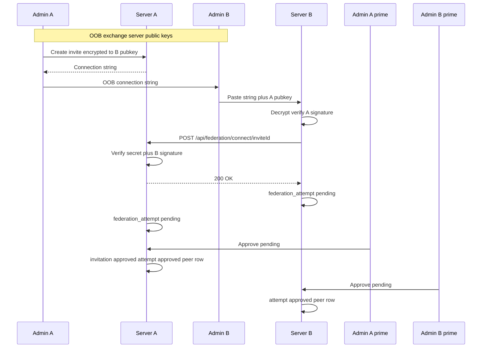

# Federation 00 — Design + handshake model

## Status

Proposed.

## Depends on

[roles 00](../roles/00_design.md)

## Context

The first federation draft used operator-out-of-band **`serverID` + URL +
fingerprint** pasted into a peer registry. That is too loose and has no
handshake or multi-admin consent.

This revision locks an **invite-based connection ceremony** with encrypted
payloads, a server callback, and **second-admin approval** before
`federation_established`.

## Scope

- End-to-end operator + server flow between **Server A** (initiator) and
  **Server B** (responder).
- Three bookkeeping tables per instance.
- Admin **Mesh** UI subsection (first admin UI in federation track).

## Non-goals

- Cross-instance content relay (later phase).
- Automatic peer discovery.
- Single-admin shortcut (allowed only if instance has one admin — documented
  edge case).

## Design

### Actors

| Actor | Role |
|-------|------|
| **Admin A** | Initiator: creates encrypted invite on Server A |
| **Admin B** | Responder: pastes connection string on Server B |
| **Admin A′** | Different admin on A: approves pending link (≠ Admin A) |
| **Admin B′** | Different admin on B: approves pending link (≠ Admin B) |
| **Server A / B** | HTTP callback, signature verify, storage |

### Phase 0 — Exchange public keys (OOB)

Before creating an invite, **Admin A** needs **Server B’s** server signing
public key (OpenPGP armor) through an **independent channel** (Signal,
in-person, etc.).

**Server A’s** public key is **not** exchanged OOB — it travels inside the
encrypted connection string (`publicKeyArmor` in the decrypted payload).

### Phase 1 — Admin A creates invite (Server A)

**UI:** Admin tab → **Mesh** → **New connection** → **Create invite**.

1. Prompt for **remote server public key** (B’s key from phase 0).
2. Server A generates:
   - `inviteId` (random id)
   - `secret` (high-entropy; store **hash** in DB only)
   - Initiator block: `serverId`, `baseUrl`, `fingerprint` (A’s server key),
     **`signature`** (A’s server key signs canonical invite bytes — see 01)
3. Build plaintext JSON (wire name **`connectionPayload`**):

```json
{
  "inviteId": "...",
  "serverId": "...",
  "baseUrl": "https://a.example",
  "fingerprint": "...",
  "publicKeyArmor": "-----BEGIN PGP PUBLIC KEY BLOCK-----…",
  "signature": "...",
  "secret": "..."
}
```

`publicKeyArmor` is the initiator server signing public key so the responder
can verify `signature` after decrypt — no separate OOB key paste at accept.

4. **Encrypt** JSON to B’s public key → **connection string** (armored/binary
   as locked in 01).
5. Insert **`federation_invitation`** row (`status = new`, **`created_by`** =
   Admin A); show connection string to Admin A to copy/share OOB with Admin B.
6. Any admin may **revoke** invites still in **`new`** (`status = revoked`).
7. **All admins** can list every invite on the instance (not creator-scoped).

### Phase 2 — Admin B accepts invite (Server B)

**UI:** Admin tab → **Mesh** → **New connection** → **Accept connection
string**.

1. Admin B pastes **connection string** only.
2. Server B decrypts with **local server private key** (HSM/keychain — same
   material as server signing key or dedicated federation decrypt key — lock in
   01).
3. Parse fields; read **`publicKeyArmor`** from payload; **verify A’s
   `signature`** over invite bytes with that public key (must match
   `fingerprint`).
4. Server B builds **response block** with B’s `serverId`, `baseUrl`,
   `fingerprint`, **`signature`** (B signs canonical response bytes binding
   `inviteId`, B’s identity, and A’s `inviteId`).
5. Server B **POST** to:

```
https://{baseUrl from payload}/api/federation/connect/{inviteId}
```

Body (JSON):

```json
{
  "serverId": "...",
  "baseUrl": "https://b.example",
  "fingerprint": "...",
  "signature": "...",
  "secret": "..."
}
```

6. On **2xx**, Server B inserts **`federation_attempt`** locally
   (`status = pending_approval`, **`invite_id`** from payload for correlation,
   **`responded_by`** = Admin B who pasted).

### Phase 3 — Server A validates callback

`POST /api/federation/connect/{inviteId}` (allowlisted — no user auth; secured
by **secret hash** + **signatures**):

1. Load **`federation_invitation`** by `inviteId`; must be **`new`**.
2. Compare `secret` to stored hash → else **403**.
3. Verify B’s **`signature`** with B’s fingerprint from body (first pin).
4. Insert **`federation_attempt`** on A (`invite_id` FK → invitation,
   **`responded_by`** from connect body when B supplies paste-admin id).
5. Set invitation **`status = accepted`** (row retained).

### Phase 4 — Second-admin approval (both servers)

**UI:** Admin tab → **Mesh** → **Pending connections**.

Each server holds a **`federation_attempt`** awaiting approval.

Rules:

- Approver must be **`admin` or `root`**.
- Approver must **not** be the admin who created the invite (A) or pasted the
  string (B) **on that server** — “different admin than the two already
  involved.”
- If the instance has **only one admin**, approval by that admin is allowed
  (degraded; log warning).

On **Accept** (local):

1. Verify attempt still `pending_approval`.
2. Set **`approved_by`** on the attempt; attempt **`status = approved`**.
3. Insert **`federation_established`** with **`attempt_id`** FK → attempt.
4. Set linked invitation **`status = approved`**.

Both sides must approve **locally** before either treats the link as live for
runtime verify (04). Rows are **not deleted** — audit chain:
`federation_established` → `federation_attempt` → `federation_invitation`
(creator on invite, responder on attempt, approver on attempt + established
row). **Peering revoke** (`federation_established.revoked`) is separate from
invite status — an **`approved`** invite stays **`approved`** even after the
connection is revoked.

### Tables (each instance)

| Table | Purpose |
|-------|---------|
| **`federation_invitation`** | Outbound invites; **`created_by`**; status **`new` \| `accepted` \| `approved` \| `revoked`** |
| **`federation_attempt`** | Handshake + approval; **`invite_id`** FK; **`responded_by`**; **`approved_by`** |
| **`federation_established`** | Live (or revoked) peers; **`attempt_id`** FK; **`revoked`** boolean |

**Initiator (A)** owns the invitation row through the full lifecycle. **Responder
(B)** stores a local **`federation_attempt`** keyed by the foreign **`invite_id`**
from the decrypted payload (no local invitation row unless B also created an
outbound invite separately).

No long-lived copy of plaintext **`secret`** after handshake; established
peers authenticate with **pinned remote fingerprint** + future peer-auth
(04).

### End-state diagram



### Dual role after establishment

Same as prior draft: established peer → federation **client** for
`(remoteServerId, userId)` verify; local server remains **IdP** for own users.

### Relationship to `serverID`

Refs like `userId@serverId/reedId` resolve only when `serverId` appears in
local **`federation_established`** with **`revoked = false`**.

### Revoke peering ([05](05_revoke_established.md))

Any admin may set **`revoked = true`** on a **`federation_established`** row.
This instance then returns **401** to incoming federation requests from that
peer and stops outbound peer calls locally. The remote instance is **not**
notified and does not auto-revoke. The linked invitation remains
**`approved`** — revoke is peering state, not invite state.
