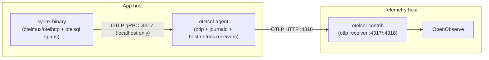
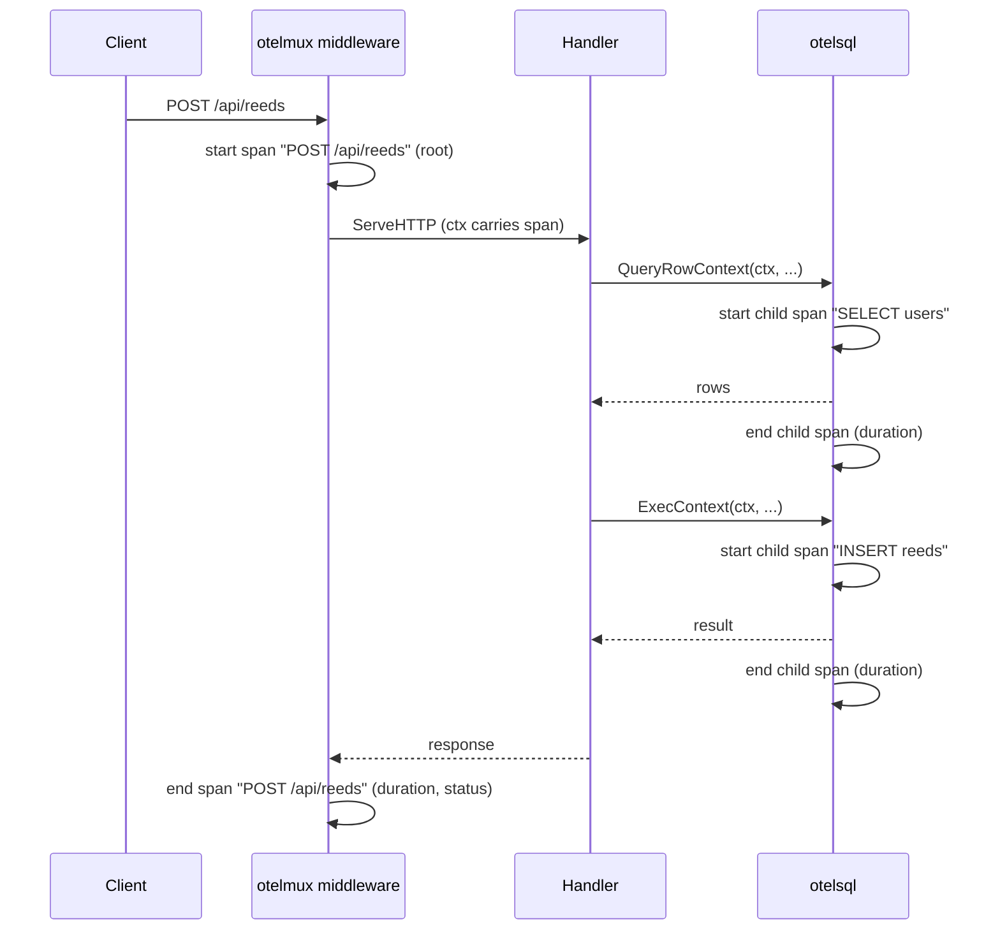

# Observability 00 — Design + architecture + locked decisions

## Status

Proposed.

## Depends on

—

## Context

The self-hosted telemetry stack (OpenObserve + `otelcol-contrib` on a
dedicated Pi, `otelcol-agent` shipping journald logs + hostmetrics from the
app host) already ships structured logs and host-level metrics
(CPU/memory/disk/network via the `hostmetrics` receiver) — aggregate machine
stats, no per-user data. Anything that fingerprints individual users
(session replay, per-user dashboards, etc.) is explicitly not wanted in this
stack.

What's still missing is **request-level and query-level timing**: "how long
did this request take, which DB queries did it run, how long did each one
take." That's what OpenTelemetry *traces* are for, and the SDK scaffolding
for it already exists in `observability.go` — it's just never invoked, and
the DB layer is never instrumented.

## Scope

- Open a local OTLP ingress on the app host so the app process has somewhere
  to send spans (infra change, `rpi` repo, not this one).
- Call the existing `SetupObservability()` from `main.go`.
- Create one span per HTTP request (method, matched route, status, duration).
- Create one span per DB query (statement, duration, error), as a child of
  the request span that triggered it.
- Spans carry aggregate/structural data only (route template, SQL statement
  shape, durations, status codes) — never user IDs, query argument values,
  or request bodies.

## Non-goals

- Long-term trace retention/sampling policy tuning — start with
  `AlwaysSample()` (already the default in `NewObservabilityManager`) and
  revisit if trace volume becomes a storage concern.
- Alerting on latency (p99, etc.) — a natural follow-up once traces/metrics
  exist, but a separate spec.
- Tracing across process/service boundaries beyond this one Go binary (there
  is only one backend service today).

## Architecture

The app host's collector is the new piece ([01](01_agent_otlp_receiver.md));
everything downstream of it (telemetry Pi ingress, OpenObserve, the `syrinx`
stream) already exists and needs no changes — traces land in the same
stream/org as logs and metrics today.

## Request trace shape (target)

One trace per request, viewable in OpenObserve as a single waterfall: total
request duration at the top, each DB call as a nested span with its own
duration underneath. This shape is only achievable if the DB spans share the
request's trace context — see [04](04_context_threading.md), which is the
part that makes this nesting real rather than a set of disconnected spans
that merely overlap in time.

## Library choices

| Concern | Library | Notes |
|---|---|---|
| Core SDK | `go.opentelemetry.io/otel/sdk` | already a dependency |
| Trace export | `go.opentelemetry.io/otel/exporters/otlp/otlptrace/otlptracegrpc` | already a dependency, already used by `NewObservabilityManager` |
| HTTP spans | `otelmux` or `otelhttp` | see [02](02_app_bootstrap.md) |
| DB spans | `github.com/XSAM/otelsql` | new dependency |

## Privacy rule

Spans and their attributes must never contain:

- Query argument values (usernames, bios, keys, tokens, etc.) — only the SQL
  statement shape (`SELECT ... FROM users WHERE id = $1`).
- Request/response bodies.
- Per-user identifiers as high-cardinality span attributes (a `user.id`
  attribute on a span is fine for debugging one request; anything that turns
  into a per-user *dashboard* or aggregation is not what this is for).

If a future need arises to correlate spans back to a specific user's support
ticket, prefer a short-lived, explicitly-opted-in debug header over
always-on user tagging.
