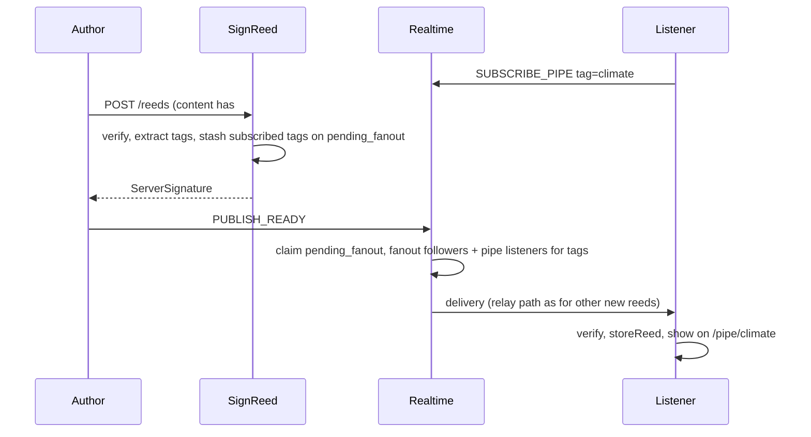

# Pipes 00 — Design + naming + locked model

## Status

Proposed.

## Depends on

—

## Context

Hashtags in reed markdown already become links
([`reedMarkdown.ts`](../../spa/src/lib/utils/reedMarkdown.ts) →
`web+syrinx://channel/…`), but there is no destination page and no live
subscription.

Users want: click `#tag` → a live view of that tag. The network does not
owe them the full history of that tag—only what is blowing through **now**,
plus whatever matching reeds they already hold.

Mentions ([conversations 04](../conversations/04_mentions.md)) may keep a
durable tip index for offline delivery; **pipes do not**. A pipe is a
livestream: the server only bridges SignReed → `PUBLISH_READY` with tag
names, then forgets them.

## Scope

- Name and URI scheme for the feature.
- Lock ephemeral-server / durable-local semantics.
- Outline tag extract + unlogged stash, WS subscribe, fanout on
  `PUBLISH_READY`, and SPA page.

## Non-goals

- Server-side hashtag search or paginated history API.
- Durable tip index of tags (`reed_tags` or equivalent).
- Persistent “follow this tag” across sessions without an open pipe
  (v1 = subscribe while the pipe page is mounted; reconnect while still
  on the page may resubscribe).
- Autocomplete of tags in the composer (may come later).
- Federation of pipe subscriptions across instances.
- Catch-up for clients who subscribe after SignReed but before READY.

## Naming

“Channel” and “stream” are accurate but generic (Slack/Discord/Twitch).
Syrinx’s myth is Pan and the naiad **Syrinx**: she becomes river-reeds;
Pan’s breath through those reeds becomes music; he binds unequal reeds
into the **syrinx** (panpipes).

| Candidate | Fit | Notes |
|-----------|-----|--------|
| **Pipe** | Strong | One tube of the syrinx; you put your ear to `#tag` and hear what sounds through it. Pairs with **reed** (the post). |
| Reedbed | Strong | A bed of reeds of one kind; a bit heavier / place-like. |
| Murmur | Poetic | Ovid’s soft wind in the marsh reeds — live, ambient, forgetful. Less obvious as a noun for a screen. |
| Ladon | Myth-pure | The river of the transformation — live current. Opaque to new users. |
| Stream | Clear | Too product-generic; overlaps “livestream.” |

**Locked product term: pipe.**

- UI: “Pipe `#climate`”, route `/pipe/climate`.
- Wire: `SUBSCRIBE_PIPE` / `UNSUBSCRIBE_PIPE`, `tag` field.
- URI: `web+syrinx://pipe/<tag>` (replace provisional `…://channel/…`).

## Design

### Terms

- **Tag** — normalized hashtag string without `#` (lowercase).
- **Pipe** — the live listening surface for one tag.
- **Listener** — a connected client that has `SUBSCRIBE_PIPE` for that tag.

### Ephemeral server, sticky local

```text
Server:  no tag timeline; unlogged tag names only until READY;
         who is listening now (connection-local)
Client:  lists reeds already in IndexedDB that carry the tag;
         while subscribed, new matching reeds are verified and stored
```

Opening the pipe again shows those stored reeds (e.g. the three received
last time) even though the server never replays them. Missed publishes
while not subscribed are not recoverable from the server.

This matches philosophy: ambient flood is not a write ticket; **choosing
to open a pipe** is the agreement to keep what arrives there (same family
as opening a reed or following an author—not broadcast session storage).

### Sequence



### Tag extraction and stash

At `SignReed`, parse tags from `content` with the same rules as the SPA
(`(^|\s)#\S+` → trim `#` → lowercase → unique). Discard the body as today.

Intersect extracted tags with tags that currently have ≥1 pipe subscriber.
If that set is non-empty, store those **tag names** (not subscriber IDs)
on the unlogged `pending_fanout` row for this tip (`tags TEXT[]`), together
with the existing READY gate. Empty / no listeners → leave `tags` empty
(or omit pipe work).

No durable tip index. No cleanup on reed/account removal beyond the normal
`pending_fanout` cascade / READY claim delete.

Someone who `SUBSCRIBE_PIPE`s after SignReed but before READY does **not**
get that reed on the pipe (v1). At READY, resolve **current** listeners
for the stored tag names (an unsubscribe in the gap simply receives nothing).

### Live delivery

Fanout runs only on `PUBLISH_READY` (same race as follows: holders must be
able to serve relay). Reuse the existing new-reed relay machinery (pending
event → holder → `DATA_RESPONSE` / ack). Pipe listeners are an additional
recipient set beside followers / broadcast / profile subs—not a second
content path. Prefer a union of recipient sets so a listener who is also a
follower gets one pending event, not two.

Author’s own reed is already local; listeners who do not hold it yet go
through relay.

### SPA

1. Rename link helper/path from `channel` → `pipe`.
2. Route `/pipe/[tag]`: title `#tag`; list local reeds matching tag
   (newest first); while mounted, `SUBSCRIBE_PIPE` / on destroy
   `UNSUBSCRIBE_PIPE`.
3. On live arrival for this tag: verify, `storeReed`, prepend to the list.
4. Offline: show local matches; subscription waits until reconnect (no
   server backfill).

### Tag rules (v1)

- Normalize as above.
- Empty tag after `#` is not a tag.
- No server-side ban list in v1 (operators may add later).
- Max tags per reed: inherit content size limits; no separate cap required
  unless abuse appears.

## Open points (resolve in 01–02)

- Exact WS payload shape when protobuf cutover lands (string `type` until
  then, matching today’s JSON WS).
- Whether leaving the pipe page always unsubscribes (yes for v1) or a
  background “pinned pipes” list exists (out of scope).
