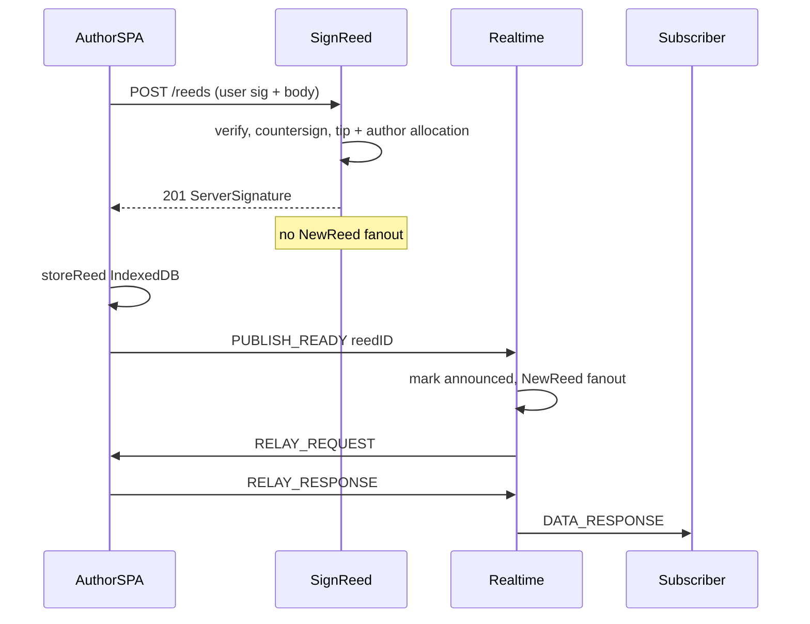

# Publish 00 — Design + race + locked model

## Status

Proposed.

## Depends on

—

## Context

Reed tip metadata and the author countersignature are created over **HTTP**
(`POST /reeds` / `SignReed`). Content relay, allocations, and follower
fanout run over the **WebSocket**. That split races:

1. Author `POST /reeds`.
2. Server inserts tip + author allocation, returns the countersignature,
   then (today) broadcasts `NewReed` and `dispatchNext(author)`.
3. Author receives `RELAY_REQUEST` **before** parsing the POST body and
   writing the fully signed reed to IndexedDB.
4. Author replies `RELAY_MISS`.

Temporary mitigation: ignore `RELAY_MISS` (keep allocation, no retry).
Recovery depends on requester `SYNC_REQUEST`. See
[`realtime/README.md`](../../realtime/README.md).

## Scope

- Gate fanout on author **`PUBLISH_READY`** after local store.
- Keep HTTP countersign.
- Restore meaningful `RELAY_MISS` once READY is required.

## Non-goals

- Moving countersignature to a WS `PUBLISH_REED` / `PUBLISH_ACK` flow
  (optional later; not required to fix the race).
- Changing what “allocated” means for catch-up / coverage.
- Discriminating relay handling for “reeds just published” vs any other
  reed — one path for all `RELAY_REQUEST`s.

## Design

### Target sequence

### Locked rules

1. **HTTP never fans out.** `SignReed` persists and returns the signature
   only. Idempotent replay still returns the stored signature and still
   does **not** re-fanout (READY / announced flag owns that).
2. **READY means local serveability.** Client sends `PUBLISH_READY` only
   after the fully signed reed is in IndexedDB (and on reconnect for tips
   it holds that are not yet announced — see 01).
3. **Server on READY.** Authenticated caller is the tip author; tip exists;
   if not yet announced, run today’s follower / broadcast / profile fanout
   and `dispatchNext`. READY is **idempotent** (second READY is a no-op or
   safe re-dispatch policy — prefer no-op if already announced).
4. **Uniform relay.** No special-case “wait instead of miss for fresh
   publishes.” Find reed → respond; else → miss.
5. **Miss is real.** Drop that holder’s allocation and try another holder
   (02). Safe once fanout cannot start before the author can serve.

### Why not full WS publish

HTTP SignReed already has verify, idempotent countersign storage, and SPA
pending-reed UX. The missing signal is only **“author can serve content
now.”** READY adds that without relocating countersigning.
